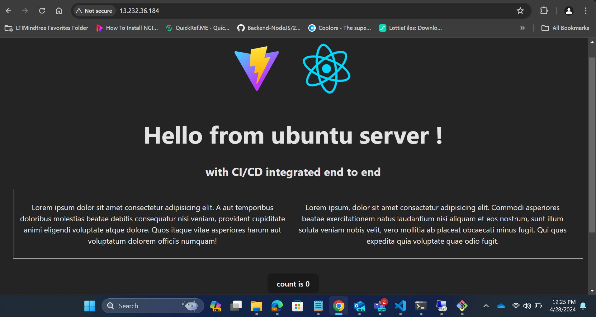
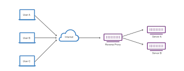
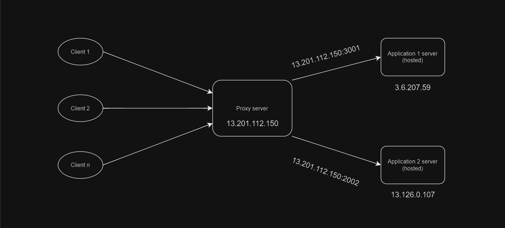
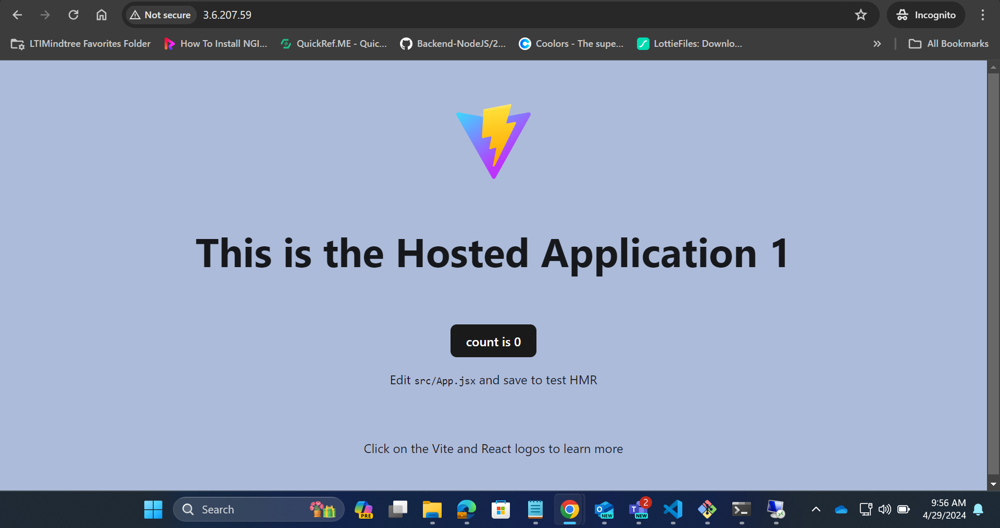
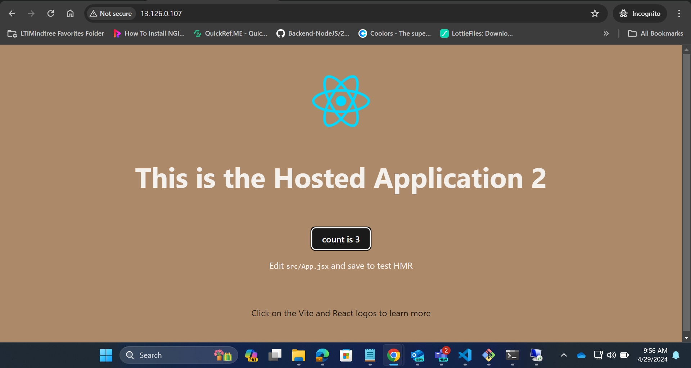
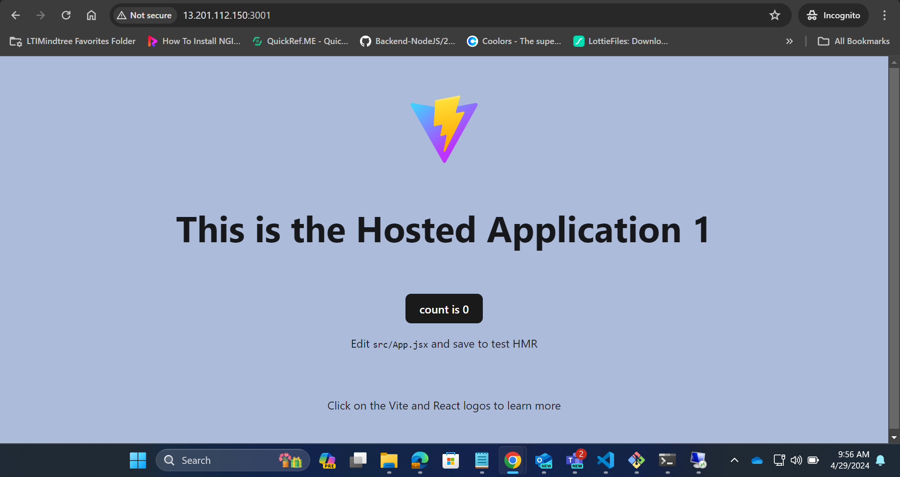
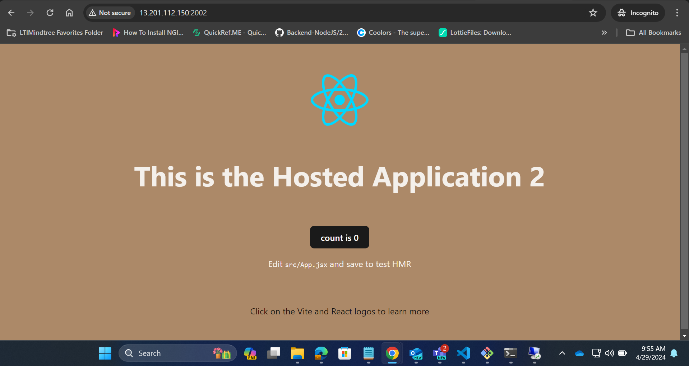

# Nginx guide -

----
Nginx (pronounced as “Engine-X”) is an open source web server. It is often used as :
- Reverse Proxy
- HTTP Caching
- Load Balancing.

## Nginx Installation

----
To install Nginx, use following command :
```bash
    sudo apt update
    sudo apt install nginx
```
After installing it, you already have everything you need.
- By default Nginx runs on port 80.

You can point your browser to your server IP address. You should see this page:


If you see this page, you have successfully installed Nginx on your web server.

----
### ``Note -``
In Nginx default page is placed in ``/var/www/html/ location``. You can place your static pages here, or use virtual host and place it other location.

----

## Creating our own website (Hosting a Basic React Vite Application on Nginx)

----
### Prerequisites

- Node.js and npm installed on your development machine.
- An existing basic React Vite application.
----


## ``Steps``

### Step 1: Build your React Vite application

Before deploying your application, you need to build it. Navigate to your project directory and run:

```bash
npm run build
```
This will create an optimized production build of your React Vite application under dist folder.

Now, create a ``tutorial`` folder inside ``/var/www`` and copy the contents of ``/dist`` into ``tutorial``.

create a tutorial folder under ``/var/www``
```bash
    cd /var/www
    sudo mkdir tutorial
```

Navigate inside your react build i.e inside ``/dist`` folder. In my case it is like, ``/home/ubuntu/vite-nginx/dist/``.
```bash
cd /path/to/your/react/dist
```

Copy all the contents of build i.e ``/dist`` into tutorial folder.
```bash
sudo cp -r * /var/www/tutorial
```

### Step 2: Setting up virtual host
To set up virtual host, we need to create file in ``/etc/nginx/sites-enabled/`` directory.

```bash
    cd /etc/nginx/sites-enabled
    sudo "${EDITOR:-vi}" tutorial
```

change the default configuration to -

```conf
    server {
           listen 80;
           listen [::]:80;
    
           server_name example.ubuntu.com;
    
           root /var/www/tutorial;
           index index.html;
    
           location / {
                   try_files $uri $uri/ =404;
           }
    }
```

``root`` is a directory where we have placed our .html file. ``index`` is used to specify file available when visiting root directory of site. ``server_name`` can be anything you want, because you aren’t pointing it to any real domain by now.

### Step 3: Activating virtual host and testing results
To make our site working, simply restart Nginx service.

```bash
    sudo service nginx restart
```

Let’s check if everything works as it should. Open our newly created site in web browser. Remember that we are using default :80 port.


If this page is up, we have just configured Nginx web server on port 80.
This is basics of nginx which we have covered in this documentation.
----
## Nginx as Reverse Proxy -
---
A reverse proxy is a server that sits in front of web servers and forwards client (e.g. web browser) requests to those web servers. Reverse proxies are typically implemented to help increase security, performance, and reliability.



# Setting Up a Reverse Proxy with Nginx
----
## Prerequisites

- A server with Nginx installed. You can install Nginx on Ubuntu with `sudo apt-get install nginx`.

## Steps

### Step 1: Configure Nginx

1. Navigate to the Nginx configuration directory. This is commonly located at `/etc/nginx/`.

2. Open the default configuration file in a text editor. This is often named `default` or `nginx.conf`.

3. Inside the `server` block, add a new `location` block to define the path you want to proxy and the backend server to forward requests to. For example:

    ```nginx
    server {
        listen 80;
        server_name example.com;

        location / {
            proxy_pass http://backend_server;
        }
    }
    ```

    Replace `example.com` with your domain name and `backend_server` with the address of your backend server.

4. Save the configuration file and exit the text editor.

### Step 2: Test and Reload Nginx

1. Test the Nginx configuration for syntax errors:

    ```bash
    sudo nginx -t
    ```

2. If the test is successful, reload Nginx to apply the new configuration:

    ```bash
    sudo systemctl reload nginx
    ```

### Step 3: Configure Backend Server (Optional)

If your backend server requires specific configurations to work with the reverse proxy, make sure those configurations are set up. This might include configuring the backend server to accept requests from the reverse proxy's IP address.

### Step 4: Verify

Test the reverse proxy by accessing your domain in a web browser. Nginx should forward requests to the backend server and return the response to the client.

In this way you can configure reverse proxy.


## Implementing our own reverse proxy -
----
In this we are using three servers.

- ``13.201.112.150`` --- proxy server
- ``3.6.207.59`` --- application 1 server
- ``13.126.0.107`` --- application 2 server



To achieve this, host the application 1 on ``3.6.207.59`` server and application 2 on ``13.126.0.107``server. follow ```Creating our own website (Hosting a Basic React Vite Application on Nginx)```


Application 1 is hosted on ``3.6.207.59`` IP.


Application 2 is hosted on ``13.126.0.107`` IP.

After hosting the applications on both the servers, install nginx on all three servers.

### Now setup nginx configuration on all the servers -

``Proxy Server Configuration- ``

```nginx
    server {
        listen 3001;
        server_name www.example.com;

        location / {
            proxy_pass http://3.6.207.59:80;
            proxy_set_header Host $host;
            proxy_set_header X-Real-IP $remote_addr;
            proxy_set_header X-Forwarded-For $proxy_add_x_forwarded_for;
        }
    }

    server {
        listen 2002;
        server_name www.example.com;

        location / {
            proxy_pass http://13.126.0.107:80;
            proxy_set_header Host $host;
            proxy_set_header X-Real-IP $remote_addr;
            proxy_set_header X-Forwarded-For $proxy_add_x_forwarded_for;
        }
    }
```
### ``Note - ``
Make sure to enable the traffic on port 3001 and 2002 in Proxy server.

``Application 1 Server Configuration- ``

```nginx
    server {
        listen 80;
        listen [::]:80;

        server_name example.com;

        root /var/www/build;
        index index.html;

        location / {
                try_files $uri $uri/ =404;
        }
    }
```

``Application 2 Server Configuration- ``

```nginx
    server {
        listen 80;
        listen [::]:80;

        server_name example.com;

        root /var/www/build;
        index index.html;

        location / {
                try_files $uri $uri/ =404;
        }
    }
```

### ``Note - ``
In both the application servers websites are hosted under build folder on the path ``/var/www/build``

After implementing this now Application 1 and Application 2 are accessible via proxy server.


Application 1 is accessible via ``13.201.112.150:3001`` IP.


Application 2 is accessible via ``13.201.112.150:2002`` IP.

This is how we can use Nginx as Reverse Proxy.